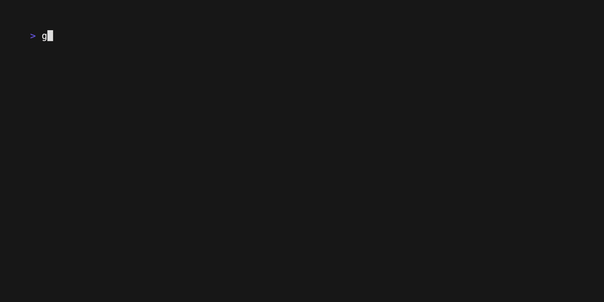

# gotable

A simple Go library for rendering tables in the terminal. Easy to customize and designed for integration with [Bubble Tea](https://github.com/charmbracelet/bubbletea).



## Installation

```bash
go get github.com/ionut-t/gotable
```

## Usage

See [examples/main.go](examples/main.go) for a complete usage example.

## Acknowledgments

- [Bubble Tea](https://github.com/charmbracelet/bubbletea) for the TUI framework.
- [Lip Gloss](https://github.com/charmbracelet/lipgloss) for styling.

## License

[MIT](LICENSE)

